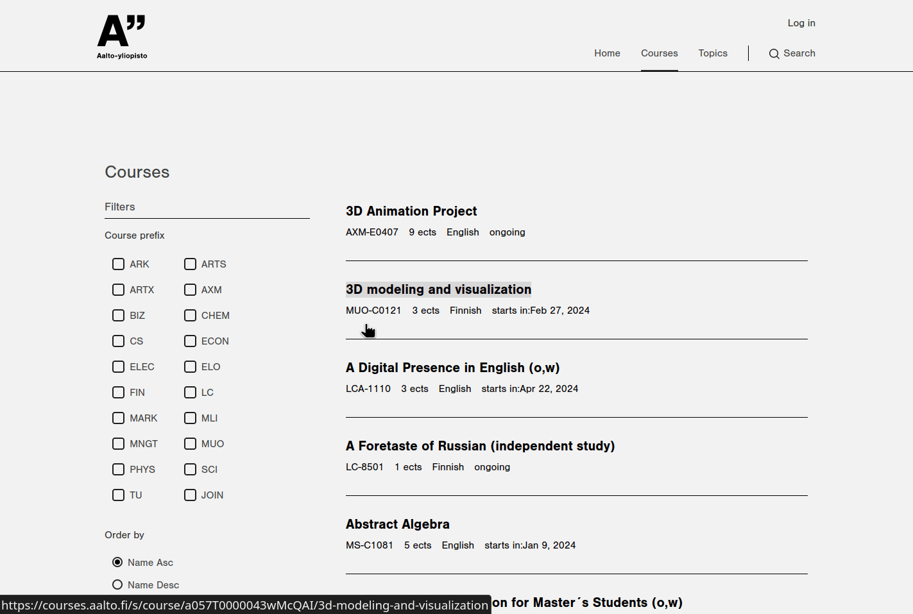
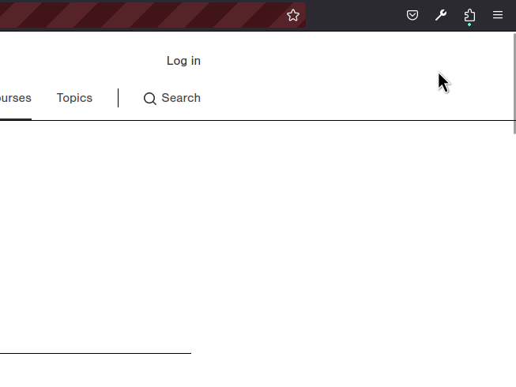

# courses-aalto-better-filters



[courses.aalto.fi](https://courses.aalto.fi/s/course/hed__Course__c/Default?language=en_US)
has garbage-tier UX. This is a hack to try and improve specifically the
filtration of the courses.

### Features

- _Filtering courses by the prefix of the course code._ Roughly speaking, this
  means filtering by which school department is responsible for the course.

- _Filtering by period._ Filter by which period the course starts in.

- _Positive & negative filters._ Positive filters display only courses matching
  the selected filter. Negative filters display courses that **don't** match the
  filter. Positives override negatives so negatives will only work if only
  negative filters of a certain filter type are selected.

- _Displaying period data in courses._ courses.aalto does not display which
  period each course is held in. This extension adds that information to the
  course listing.

### Building

This package is configured to use [Bun](https://bun.sh).

```
bun install
bun run build
```

This compiles the TS files to JS and copies other files to the `build` folder. The
`manifest.json` in `build` can then be used as the start point of the extension.

### Running locally

Get familiarized with [the WebExtensions docs](https://developer.mozilla.org/en-US/docs/Mozilla/Add-ons/WebExtensions).

```
bun run dev
```

to build compile JS files and watch for modifications.

```
bun run client
```

to run [web-ext](https://extensionworkshop.com/documentation/develop/getting-started-with-web-ext/)
with Firefox developer edition. You can also run the extension in different ways as shown in [this
guide](https://developer.mozilla.org/en-US/docs/Mozilla/Add-ons/WebExtensions/Your_first_WebExtension).

You can also use `adb` with `web-ext` to run the extension on Firefox for
Android.

```
bun run client:mobile
```

The extension only has functionality in https://courses.aalto.fi. Once
navigating there, the extension needs to be given permissions to run. This can
be done by opening the extensions menu, opening the settings for the extension,
and selecting "_Always allow on courses.aalto.fi_".


